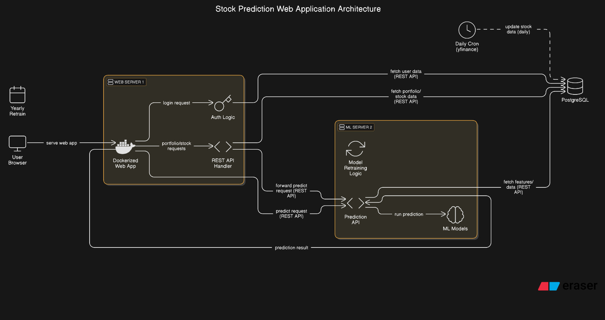

# **Stock Price Prediction System - Design Document**

## **1. Overview**
This document outlines the architecture and design of a **Stock Price Prediction System** that uses machine learning to forecast stock prices. The system leverages **DVC (Data Version Control)** for pipeline management, **PostgreSQL** for data storage, **MLFlow** for experiments, **grafana** for visualisation and **PyTorch** for deep learning.

---

## **2. System Architecture**
### **2.1 High-Level Diagram**


## **3. Core Components**
### **3.1 Data Pipeline (DVC)**


## Pipeline Structure

fetch -> apply scale transform -> predict -> inverse scale transform

## Key Stages

### 1. Data Fetch (`fetch.py`)
- **Input**: None (pulls from database)
- **Output**: `data/raw/latest_data.pt`
- **Action**: 
  - Fetches 30 days of stock data from DB
  - Saves as PyTorch tensor

### 2. Prediction (`predict.py`) 
- **Input**: Raw data + trained model
- **Output**: `data/processed/predictions.pt`
- **Steps**:
  1. Loads latest BiLSTM model from MLflow
  2. Applies scaling to input data
  3. Generates predictions
  4. Reverses scaling on outputs

## Dependency Management
- Tracked by DVC files:
  - `scalers.dvc` (feature scaling parameters)
  - `models.dvc` (model weights/architecture)

## Execution Flow
```bash
dvc repro  # Runs complete pipeline
dvc dag    # Visualizes dependencies
```

> **Note**: Pipeline ensures reproducible scaling and prediction by versioning all transformations.


### 3.2 Core MLflow Integration
1. **Experiment Setup**
   - Creates MLflow experiments with configurable names
   - Auto-detects GPU/CPU and logs device info
   - Tracks all model & training parameters via `mlflow.log_params()`

2. **Model Training**
   - Initializes `MultiStockLSTM` with given config
   - Handles device placement (GPU/CPU)
   - Wraps training process with MLflow tracking

3. **Model Logging**
   - Logs PyTorch models with:
     - Model signature (input/output schema)
     - Input example
     - Code dependencies
   - Registers models with descriptive names
   - Ensures CPU compatibility for serving

4. **Metrics Tracking**
   - Logs best validation loss
   - Records training/validation curves per epoch
   - Uses step-wise metric logging

### Experiment Variations
1. **Baseline LSTM**
   - Single layer, no dropout
   - 32 hidden units

2. **Deeper LSTM**
   - 2 layers with 0.3 dropout
   - 64 hidden units

3. **Bidirectional LSTM**
   - 2 bidirectional layers
   - 64 hidden units
   - 0.3 dropout

### Key Features
- **Reproducibility**: All parameters and code versions logged
- **Comparability**: Enables easy experiment comparison
- **Deployment Ready**: Models include signatures and examples
- **Flexible**: Supports different architectures via config

### Usage Flow
1. Define model/training configs
2. Call `run_experiment()` for each variant
3. Results automatically tracked in MLflow
4. Models versioned and registered

This implementation provides full experiment tracking while maintaining flexibility to test different model architectures. The logged models can later be loaded for inference or comparison via MLflow's model registry.
---

### **3.3 ML Model (PyTorch)**
**Models:**
LSTM were used because they are good at handling time series data. From a sequence of length 30 it is capable of finding the prediction for the next data.
1. **Baseline LSTM**
   - Single layer, no dropout
   - 32 hidden units

2. **Deeper LSTM**
   - 2 layers with 0.3 dropout
   - 64 hidden units

3. **Bidirectional LSTM**
   - 2 bidirectional layers
   - 64 hidden units
   - 0.3 dropout


**Training Workflow:**
1. **Input**: `[batch_size, seq_len=30, n_features=4]` (OHLC prices)
2. **Output**: `[batch_size, n_features=4]` (Next day prediction)
3. **Loss**: `MSE` between predicted and actual prices

---

## **4. Workflow**
### **4.1 Data Flow**
1. **Fetch**: `yfinance` → CSV/PostgreSQL
2. **Preprocess**:  normalize using trained scalers
3. **Train**: using mlflow to track experiments
4. **DVC pipeline (CICD)**: Automatically fetch last 30 days make predictions and communicate to server1 via RESTAPI endpoint
5. **Predict**: Generate next-day forecasts

### **4.2 CI/CD through DVC**

---

## **5. Deployment**
### **5.1 Prediction API (FastAPI)**
```python
@app.post("/predict")
async def predict(symbol: str):
    stock_id = await get_stock_id(symbol)
    predictions = model.predict(stock_id)
    return {"symbol": symbol, "predictions": predictions}
```


---
### ** 6. APIfication** ###
runs DVC pipeline (dvc repro)

Queries DB for stock_id

Loads predictions from predictions.pt

Extracts OHLC values for requested stock and exposes it on the RESTAPI endpoint

And attends to requests example: 
GET /predict/AMZN

## **7. Monitoring & Logging**

Through grafana and prometheus
