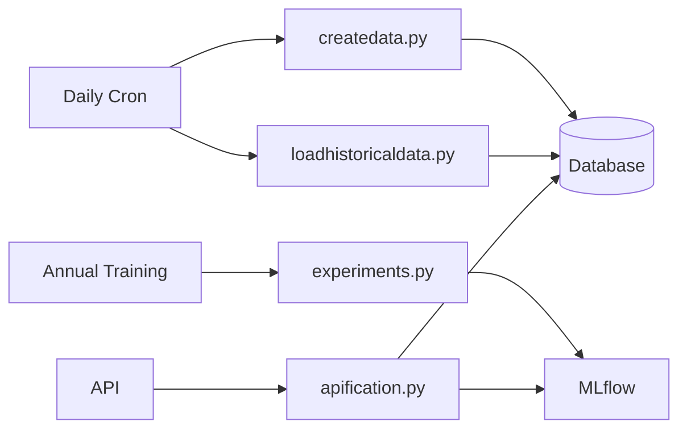

## Setup Instructions

### 1. Prerequisites

```bash
python pip install -r requirements.txt
```

## Running the System

### Option A: Run with Existing Data (For Testing)
```bash
python apification.py
```

### Option B: Dynamic Data Pipeline (Production)

#### 1. Set Up Daily Data Updates
```bash
chmod +x run_daily.sh
crontab -e
```
Add this line to run daily at 2 AM:
```bash
0 2 * * * /home/hiran/Desktop/mlops/project/stock-price-prediction/run_daily.sh
```

#### 2. Model Training (Annual)
```bash
python experiments.py
```
This will:
- Load latest data from database
- Train multiple model variants
- Track experiments in MLflow
- Register best model

#### 3. Run Prediction API
```bash
python apification.py
```

## API Usage

### Request Format
```bash
curl -X GET "http://localhost:8000/predict/{symbol}"
```

### Example Requests
```bash
# Get Amazon predictions
curl -X GET "http://localhost:8000/predict/AMZN"

# Get Apple predictions
curl -X GET "http://localhost:8000/predict/AAPL"
```

### Example Response
```json
{
    "symbol": "AMZN",
    "open": 63.14,
    "high": 89.47,
    "low": 231.03,
    "close": 524.04
}
```

## System Architecture



## Maintenance

### View MLflow Experiments
```bash
mlflow ui
```
Access at: `http://localhost:5000`

### Check DVC Pipeline
```bash
dvc dag
dvc repro
```
